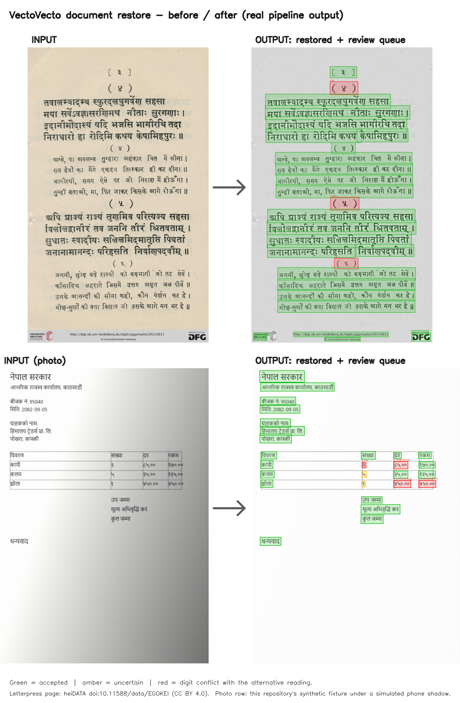

# VectoVecto

**Offline document restoration.** A photo or scan goes in; a cleaned page with
a **searchable PDF**, overlay, transcript and OCR JSON comes out — with honest
flags on the numbers it is not sure about. Devanagari (Nepali/Hindi) first,
English supported by the same pipeline.

Everything runs on your machine. No cloud calls, no telemetry, no account.

```
photo/scan ──▶ orientation ──▶ layout ──▶ OCR ──▶ risk flags ──▶ searchable PDF
                                                              ├─ overlay.png (review boxes)
                                                              ├─ transcript.txt
                                                              └─ ocr.json (tokens + queue)
```

## Before / after



Real pipeline output. **Green** = accepted, **amber** = uncertain, **red** =
digit conflict with the alternative reading kept. The letterpress page is from
heiDATA (doi:10.11588/data/EGOKEI, CC BY 4.0); the photo row is this
repository's own synthetic fixture under a simulated phone shadow. Regenerate
with `python scripts/make_demo_image.py`.

## Why it exists

- **It will not invent the numbers on your bill.** Digits are the highest-risk
  tokens, so they are re-read, risk-ranked and put in a review queue instead of
  being silently guessed. The queue is measured, not asserted
  ([EVALUATION.md](docs/EVALUATION.md)).
- **Devanagari is a first-class citizen, not a language pack.** Letterpress
  books, modern government PDFs and phone photos each have frozen evaluation
  sets with published numbers and confidence intervals.
- **Offline by default.** Privacy is the reason to use this instead of a cloud
  lens: the pipeline runs with networking disabled.

## Install

```bash
pip install -r requirements.txt        # runtime
pip install -r requirements-dev.txt    # + dev/eval tooling (optional)
```

Optional: [Tesseract 5](https://github.com/UB-Mannheim/tesseract/wiki) as a
second OCR backend (clean-scan fallback and the OSD rotation fallback).

## Use

### CLI

```bash
# Photo/scan in, searchable PDF + overlay + transcript + JSON out
python cli.py --mode document --input page.jpg --output out/run1

# Multi-page PDF (first page by default; 0 = all pages + combined PDF)
python cli.py --mode document --input scan.pdf --output out/run1 --max-pages 3

# Photo upscaling (shares the same CLI/app)
python cli.py --mode photo --input photos/ --output out/upscaled --scale 4
```

Useful knobs (all default to the measured best configuration):

```
--ocr rapidocr|tesseract     --lang en|ne|hi       --deskew
--no-reading-order           --rotate auto|off     --repass-digits/--no-repass-digits
--digit-verifier off|bodhan  (optional second-model digit check)
--no-pdf --no-overlay --no-txt
```

### Web app

```bash
python app.py                 # http://127.0.0.1:7860
```

Hosted deployments (Docker, basic auth, HF Spaces/Render/Fly) are covered in
[docs/DEPLOY.md](docs/DEPLOY.md). The app binds to localhost by default; the
pipeline, models and any training artifacts stay server-side.

### Outputs (per page)

| File | Contents |
|---|---|
| `*_restored.png` | cleaned page (`.jpg`/`.webp` also supported) |
| `*_searchable.pdf` | image + invisible text layer, selectable/copyable |
| `*_overlay.png` | numbered review boxes for the flagged tokens |
| `*_transcript.txt` | reading-order plain text |
| `*_ocr.json` | tokens, risk flags, review queue, orientation/reading-order evidence |

## Measured behaviour

Numbers below come from hash-frozen evaluation sets with bootstrap 95% CIs
(full tables, provenance and rebuild commands: [docs/EVALUATION.md](docs/EVALUATION.md)).
No number in this repo is marketing.

| Capability | Measured |
|---|---|
| Orientation (EXIF + 0/90/180/270 via OCR evidence) | 16/16 synthetic; 0/30 false rotations on upright real scans; 90/90 rotated pages decided |
| Devanagari — modern government PDFs | CER **0.135 [0.097–0.186]**, exact-token recall 0.877 (n=41, Gemini-2.5-Pro anchor GT, engine-corroborated) |
| Devanagari — letterpress books (the honest bar) | CER 0.434 [0.387–0.481], exact-token recall 0.647 (n=69, human-corrected ALTO GT) |
| Devanagari — rendered fixtures | clean CER 0.030/0.028; degraded ne 0.094 (pass) / hi 0.170 (heavy fails) |
| Digit honesty — 2× re-pass (default ON for Devanagari) | review-queue digit recall@10 **0.88** letterpress / **0.38** PDFs (was 0.73 / 0.15), ≈ +0.4 s/page |
| Flags + calibration | `script_mismatch`, `invalid_sequence` (impossible combining sequence), isotonic `cal_conf`; ECE 0.82 → 0.30 on scans |
| Optional digit verifier (`--digit-verifier bodhan`) | flags 0.71 recall / 0.81 precision; **opt-in** (cost gate failed: +8.3 s/page) |
| Multi-page PDF | `--max-pages 0` → every page + `<stem>_combined.pdf`/`.txt`; GUI "All pages" checkbox |
| Two-column reading order | arXiv set WER 0.870 → 0.268 (−69%) on split pages; >2 columns unsupported |
| Phone-photo proxy (not real photos) | CER 0.370 medium / 0.757 heavy (clean 0.135) — recognition, not honesty, is what breaks |
| Mixed-page router (opt-in) | restored text + untouched logos/photos (non-text PSNR 60–67 dB vs 18–23 dB naive); 1 invented token on photo texture → not auto-enabled |
| Detection on real pages | covers 97.5% of ALTO line boxes (area view) — recognition, not detection, is the bottleneck |

Known limitations are listed with their evidence in
[docs/EVALUATION.md](docs/EVALUATION.md) and the full research log in
[docs/PLAN.md](docs/PLAN.md).

## Project layout

```
app.py, cli.py            product entry points (studio / command line)
document_*.py, doc_*.py   pipeline: OCR, layout, orientation, restore, export, router, verifier
calibration.py            isotonic confidence calibration
smart_upscaler.py, sr_engine.py, ...   photo/vector restore stack
deva_crnn/                Devanagari line recognizer (CRNN+CTC) — research, not shipped
evals/harness/            evaluation harnesses (frozen sets, metrics, gates)
evals/manifests/          content-hash frozen evaluation sets
scripts/                  data acquisition, training export, gates, release tooling
tests/                    231 tests
docs/                     architecture, evaluation, deployment, licensing, roadmap
legacy/                   archived pre-pivot research (not part of the product)
```

## Docs

| Document | Contents |
|---|---|
| [docs/ARCHITECTURE.md](docs/ARCHITECTURE.md) | module map, data flow, extension points |
| [docs/EVALUATION.md](docs/EVALUATION.md) | frozen sets, metrics, how to reproduce every number |
| [docs/DEPLOY.md](docs/DEPLOY.md) | hosted web app (Docker, auth, spaces) |
| [docs/LICENSES.md](docs/LICENSES.md) | dependency + model license gate |
| [docs/RELEASE.md](docs/RELEASE.md) | release checklist, versioning, desktop packaging path |
| [docs/PLAN.md](docs/PLAN.md) | the full research log and decision record |

## Tests

```bash
python -m pytest tests/ -q
```

257 tests: OCR/export/routing/CLI/app, layout, orientation, language plumbing,
frozen-manifest and CI guards, GT-validity audits, error taxonomy, anchor
harness, queue metrics, Unicode-path IO, Devanagari line synthesis, CRNN
plumbing (height/width round-trip, beam search, cosine fine-tune), the
real-line mining gate and the opt-in line reader (merge geometry, table-rule
blocking, auto policy, graceful degradation, provenance).

## Data, models and licensing

This repository contains **code and evaluation evidence only**: no training
datasets, no model checkpoints and no redistributed third-party corpora.
Evaluation manifests record hashes and provenance; the data itself stays local
(`data/`, `weights/` and `artifacts/` are git-ignored). Third-party license
obligations and the air-gap story are tracked in
[docs/LICENSES.md](docs/LICENSES.md).

MIT licensed — see [LICENSE](LICENSE). Third-party components keep their own
licenses (RapidOCR/PP-OCR Apache-2.0, reportlab/pypdfium2 permissive, PySide6
LGPL, UltraSharp weights CC-BY-NC-SA and therefore excluded from commercial
builds).
