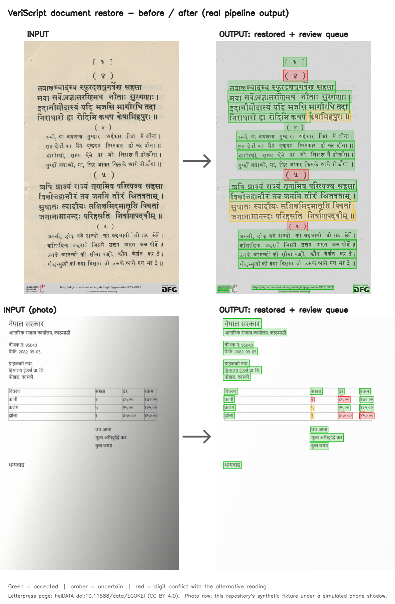

# VectoVecto

**Offline document restoration.** A photo, scan or PDF goes in; a cleaned page
with a **searchable PDF**, overlay, transcript, **Markdown** and OCR JSON comes
out — with honest flags on the numbers it is not sure about. Devanagari
(Nepali/Hindi) first, English supported by the same pipeline.

Everything runs on your machine. No cloud calls, no telemetry, no account.

```
photo/scan/PDF ──▶ orientation ──▶ layout ──▶ OCR ──▶ risk flags ──▶ searchable PDF
                                                                  ├─ overlay.png (review boxes)
                                                                  ├─ transcript.txt
                                                                  ├─ transcript.md (Markdown)
                                                                  └─ ocr.json (tokens + queue)
```

## Before / after



Real pipeline output. **Green** = accepted, **amber** = uncertain, **red** =
digit conflict with the alternative reading kept. The letterpress page is from
heiDATA (doi:10.11588/data/EGOKEI, CC BY 4.0); the photo row is this
repository's own synthetic fixture under a simulated phone shadow. Regenerate
with `python scripts/make_demo_image.py`.

## Why it exists

- **It will not invent the numbers on your bill.** Digits are the highest-risk
  tokens, so they are re-read, risk-ranked and put in a review queue instead of
  being silently guessed. The queue is measured, not asserted
  ([EVALUATION.md](docs/EVALUATION.md)).
- **Devanagari is a first-class citizen, not a language pack.** Letterpress
  books, modern government PDFs and phone photos each have frozen evaluation
  sets with published numbers and confidence intervals.
- **Offline by default.** Privacy is the reason to use this instead of a cloud
  lens: the pipeline runs with networking disabled.

## Install

```bash
pip install -r requirements.txt        # runtime
pip install -r requirements-dev.txt    # + dev/eval tooling (optional)
```

Optional: [Tesseract 5](https://github.com/UB-Mannheim/tesseract/wiki) as a
second OCR backend (clean-scan fallback and the OSD rotation fallback).

## Use

### CLI

```bash
# Photo/scan in: searchable PDF + overlay + transcript + Markdown + JSON out
python cli.py --mode document --input page.jpg --output out/run1

# PDF in: first page by default; --max-pages 3 = first three pages
python cli.py --mode document --input scan.pdf --output out/run1 --max-pages 3

# PDF → Markdown: per-page .md always; --max-pages 0 adds one combined .md
python cli.py --mode document --input report.pdf --output out/report --max-pages 0

# Photo upscaling (shares the same CLI/app)
python cli.py --mode photo --input photos/ --output out/upscaled --scale 4
```

Useful knobs (all default to the measured best configuration):

```
--ocr rapidocr|tesseract     --lang en|ne|hi       --deskew
--no-reading-order           --rotate auto|off     --repass-digits/--no-repass-digits
--digit-verifier off|bodhan  (optional second-model digit check)
--no-pdf --no-overlay --no-txt --no-md
```

### Web app (the studio)

The single UI — FastAPI + SolidJS, running the same pipeline and outputs
(searchable PDF, transcript, **Markdown**, OCR JSON) as the CLI.

```bash
pip install -r webapp/requirements-web.txt    # backend, on top of requirements.txt
cd webapp/frontend && npm install && npm run build && cd ../..
python webapp/server.py                       # http://127.0.0.1:8000
```

Hosted deployments (Docker, basic auth, HF Spaces/Render/Fly) are covered in
[docs/DEPLOY.md](docs/DEPLOY.md). The server binds to localhost by default;
the pipeline, models and any training artifacts stay server-side. The photo
upscaler is CLI-only (its weights are non-commercial); the web studio is
document-only — see [docs/PLAN_WEB_FULL.md](docs/PLAN_WEB_FULL.md).

### Outputs (per page)

For an input `page.jpg`, every run writes:

| File | Contents |
|---|---|
| `page.pdf` | searchable PDF — cleaned image + invisible Unicode text layer (Devanagari included; bundled Mukta font), selectable/copyable |
| `page_overlay.png` | cleaned page with numbered review boxes for the flagged tokens |
| `page.txt` | reading-order plain text |
| `page.md` | **Markdown transcript** — the text plus the review queue as a table (this is the PDF → Markdown output) |
| `page.json` | tokens, risk flags, review queue, orientation/reading-order evidence |
| `report_pNNN.*` | per-page set for a multi-page PDF (`report_p000.pdf`, `report_p000.md`, …) |
| `report_combined.pdf` / `.txt` / `.md` | all pages joined with `--max-pages 0`; the combined Markdown has one `## Page N` section per page |

The web studio serves the same artifacts under canonical names
(`restored.png`, `searchable.pdf`, `transcript.txt`, `transcript.md`,
`ocr.json`, `combined.md`). `--no-md` (CLI) or the Markdown toggle (web)
skips the `.md` files.

## Measured behaviour

Numbers below come from hash-frozen evaluation sets with bootstrap 95% CIs
(full tables, provenance and rebuild commands: [docs/EVALUATION.md](docs/EVALUATION.md)).
No number in this repo is marketing.

| Capability | Measured |
|---|---|
| Orientation (EXIF + 0/90/180/270 via OCR evidence) | 16/16 synthetic; 0/30 false rotations on upright real scans; 90/90 rotated pages decided |
| Devanagari — modern government PDFs (raw engine) | CER **0.135 [0.097–0.186]**, exact-token recall 0.877 (n=41, Gemini-2.5-Pro anchor GT, engine-corroborated) |
| Devanagari — letterpress books (the honest bar) | CER 0.434 [0.387–0.481], exact-token recall 0.647 (n=69, human-corrected ALTO GT) |
| Devanagari — rendered fixtures | clean CER 0.030/0.028; degraded ne 0.094 (pass) / hi 0.170 (heavy fails) |
| Digit honesty — 2× re-pass (default ON for Devanagari) | review-queue digit recall@10 **0.88** letterpress / **0.38** PDFs (was 0.73 / 0.15), ≈ +0.4 s/page |
| Flags + calibration | `script_mismatch`, `invalid_sequence` (impossible combining sequence), isotonic `cal_conf`; ECE 0.82 → 0.30 on scans; optional `unknown_word` lexicon flag (needs `scripts/fetch_nepali_lexicon.py`) lifts the frozen-PDF review queue R@10 **0.148 → 0.175** with the digit queue unchanged |
| Optional digit verifier (`--digit-verifier bodhan`) | flags 0.71 recall / 0.81 precision; **opt-in** (cost gate failed: +8.3 s/page) |
| Multi-page PDF | `--max-pages 0` → every page + `<stem>_combined.pdf`/`.txt`; GUI "All pages" checkbox |
| Two-column reading order | arXiv set WER 0.870 → 0.268 (−69%) on split pages; >2 columns unsupported |
| Phone-photo proxy (not real photos) | CER 0.370 medium / 0.757 heavy (clean 0.135) — recognition, not honesty, is what breaks |
| Mixed-page router (opt-in) | restored text + untouched logos/photos (non-text PSNR 60–67 dB vs 18–23 dB naive); 1 invented token on photo texture → not auto-enabled |
| Detection on real pages | covers 97.5% of ALTO line boxes (area view) — recognition, not detection, is the bottleneck |

Known limitations are listed with their evidence in
[docs/EVALUATION.md](docs/EVALUATION.md) and the full research log in
[docs/PLAN.md](docs/PLAN.md).

## How it compares

Head-to-head on the frozen Devanagari hard-10 (the table-heavy hardest 10 of
the 41-page `nepali_pdf_v2` set, Gemini-2.5-Pro anchor GT; every arm scored by
the same metric code — full tables and reproduction commands in
[evals/bakeoff_results.md](evals/bakeoff_results.md)):

| Engine | CER (mean [95% CI]) | Median CER | bagCER | Invented* | Speed (s/page) | Class |
|---|---|---|---|---|---|---|
| Surya OCR 2 | 0.166 [0.100–0.258] | 0.107 | 0.360 | 82 | 172.0 | Heavy — 650M VLM + llama.cpp, 4 GB GPU |
| Qwen3-VL-8B NF4 | 0.176 [0.129–0.235] | 0.141 | 0.369 | 224 | 152.7 | Heavy — 8B VLM, T4-class GPU |
| **VectoVecto pipeline (default)** | **0.255 [0.202–0.329]** | **0.227** | 0.376 | **35** | **7.3** | **Lightweight — CPU-first, 4 GB GPU enough** |
| raw RapidOCR engine | 0.530 [0.463–0.585] | 0.543 | 0.380 | 0 | 3.8 | Lightweight — CPU-first |
| PaddleOCR 3.x full pipeline | 0.662 [0.585–0.713] | 0.687 | 0.400 | 186 | 21.8 | Heavy — Paddle runtime, CPU-only in practice |

\* Tokens in neither the ground truth nor the raw-engine pass (peer rule); the
raw arm is 0 by construction. Speeds are per page on the harness hardware —
ours, raw and Surya on an RTX 2050 4 GB (Surya via llama.cpp/Vulkan), Qwen on
a T4 (NF4), PaddleOCR on CPU. Class = deployment footprint: Lightweight is
CPU-first, small bundled models, one process on a laptop; Heavy is
VLM/framework-class, > 20 s/page in practice.

**Reading.** bagCER is tied across every arm (0.360–0.400): glyph recognition
is a commodity, and the page-CER spread is reading order, table structure and
digit handling — which is where this pipeline earns its keep (0.530 → 0.255
over the raw engine on the same frozen pages, while staying CPU-first,
offline and Apache-2.0). Surya 2 reads best by median at ~23× our page time
and OpenRAIL-M weights; the VLM arms invent 82–224 tokens and PaddleOCR 186.
Only this stack ships an alternative-reading digit review queue.

## Project layout

```
cli.py                    command-line entry point (document + photo)
webapp/                   the studio: FastAPI backend (vvweb/) + SolidJS frontend
document_*.py, doc_*.py   pipeline: OCR, layout, orientation, restore, export, router, verifier
calibration.py            isotonic confidence calibration
smart_upscaler.py, sr_engine.py, ...   photo/vector stack (parked; CLI photo mode)
deva_crnn/                Devanagari line reader (CRNN+CTC), opt-in via --deva-lines
evals/harness/            evaluation harnesses (frozen sets, metrics, gates)
evals/manifests/          content-hash frozen evaluation sets
scripts/                  data acquisition, training export, gates, release tooling
tests/                    the test suite (pytest counts them; ~336)
docs/                     architecture, evaluation, deployment, licensing, plan
```

## Docs

| Document | Contents |
|---|---|
| [docs/ARCHITECTURE.md](docs/ARCHITECTURE.md) | module map, data flow, extension points |
| [docs/EVALUATION.md](docs/EVALUATION.md) | frozen sets, metrics, how to reproduce every number |
| [docs/DEPLOY.md](docs/DEPLOY.md) | hosted web app (Docker, auth, spaces) |
| [docs/LICENSES.md](docs/LICENSES.md) | dependency + model license gate |
| [docs/RELEASE.md](docs/RELEASE.md) | release checklist, versioning, desktop packaging path |
| [docs/PLAN_WEB_FULL.md](docs/PLAN_WEB_FULL.md) | web studio: audit, diet and phased plan |
| [docs/MARKET.md](docs/MARKET.md) | market landscape, competitors, positioning |
| [evals/bakeoff_results.md](evals/bakeoff_results.md) | head-to-head bake-off results on the frozen sets |
| [docs/PLAN.md](docs/PLAN.md) | the full research log and decision record |

## Tests

```bash
python -m pytest tests/ -q
```

The suite (≈336 collected) covers: OCR/export/routing/CLI/web, layout, orientation, language plumbing,
frozen-manifest and CI guards, GT-validity audits, error taxonomy, anchor
harness, queue metrics, Unicode-path IO, Devanagari line synthesis, CRNN
plumbing (height/width round-trip, beam search, cosine fine-tune), the
real-line mining gate, the opt-in line reader (merge geometry, table-rule
blocking, auto policy, graceful degradation, provenance), the lexicon
fetch/build + `unknown_word` flag mechanics, the textbook harvest parsers +
real-print scan probe, the CC-100 corpus builder + controlled sampler, the
Vertex wheel builder and the trainer GCS output path, the Devanagari
PDF text-layer extraction round-trips, the logging configuration +
server-error capture, and the Markdown export (per page and combined).

## Data, models and licensing

This repository contains **code and evaluation evidence only**: no training
datasets, no model checkpoints and no redistributed third-party corpora.
Evaluation manifests record hashes and provenance; the data itself stays local
(`data/`, `weights/` and `artifacts/` are git-ignored). The optional
Devanagari lexicon behind the `unknown_word` flag is built locally by
`scripts/fetch_nepali_lexicon.py` (Apache-2.0 + MIT sources) and is not
redistributed. Third-party license
obligations and the air-gap story are tracked in
[docs/LICENSES.md](docs/LICENSES.md).

MIT licensed — see [LICENSE](LICENSE). Third-party components keep their own
licenses (RapidOCR/PP-OCR Apache-2.0, reportlab/pypdfium2 permissive, PySide6
LGPL, UltraSharp weights CC-BY-NC-SA and therefore excluded from commercial
builds).
